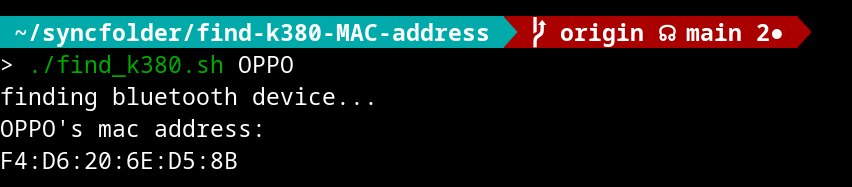

find-k380-MAC-address
===
A tool to find logitech k380's MAC address. The address can be used for bluetooth connection to linux distro.

# Usage
1. `git clone` to anywhere you want, or you can slimply download the `find_k380.sh` file
	```bash
	git clone git@github.com:CollieIsCute/find-k380-MAC-address.git
	```
2. Turn on bluetooth connecting mode, and execute the `find_k380.sh` file. You'll get the mac address.
	```bash
	cd find-k380-MAC-address
	```
	```bash
	./find_k380.sh
	```
   - 

## Other devices and conditions
- You can also type the partial name of other devices to find its MAC address.
  - 
- If more than one devices match the pattern user passed, all MAC addr. of them will be shown.
  - 